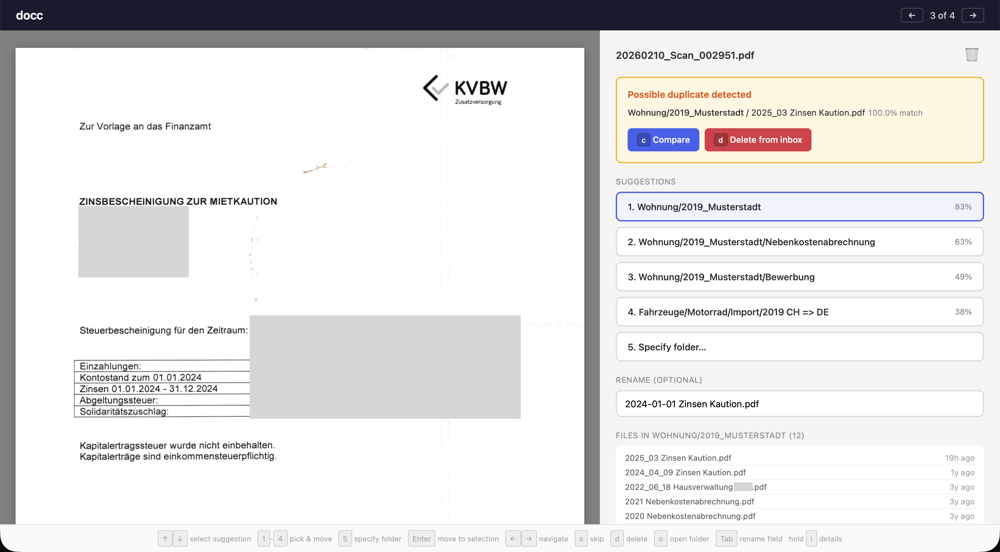

# docc - Easy sorting of scanned PDFs

Do you have an inbox full of scanned PDFs but dread sorting them into the right folder? **docc** learns from your existing folder structure and does it for you — suggesting the right folder, a proper filename, and even catching duplicates you've already filed. **Everything runs 100% locally on your machine** — no cloud APIs, no API keys, no data ever leaves your computer.

Point it at your organized documents, run `docc learn`, and it picks up the patterns. Then use the web UI or CLI to blast through your inbox: each PDF gets ranked folder suggestions, auto-generated filenames in `YYYY-MM Name.pdf` format, and duplicate warnings when it spots a re-scan. The UI is fully keyboard-driven — press a number to pick a suggestion and move the file in one keystroke. Works with German and English documents. Powered by local models via [Ollama](https://ollama.com).

**What it does:**

- **Classifies PDFs into folders** — two-method approach (semantic embeddings + Naive Bayes) combined via rank fusion, robust across 10-50+ categories
- **Suggests filenames** — matches similar documents in the target folder and generates alternatives via a local LLM
- **Detects duplicates** — flags near-identical documents already in your collection, even when filenames differ
- **Side-by-side compare** — view any inbox PDF next to existing documents in the target folder to verify before filing
- **Manual fallback** — fuzzy folder search lets you quickly pick any folder when suggestions don't match
- **Measures its own accuracy** — built-in leave-one-out cross-validation (`docc test`) on your real data

**Disclaimer:** Actual implementation of the project was mostly done with claude code. I'm happy with the result but the UI part is currently not very maintainable for mere humans (as it's all in a single file 😅)

## Web UI

`docc ui` starts an interactive web interface for batch classification. PDF preview on the left, ranked folder suggestions with confidence scores on the right. Keyboard-driven for speed.



The UI classifies each PDF, shows top-4 ranked suggestions, and loads filename suggestions asynchronously. Duplicate warnings appear above suggestions with compare/delete actions. Clicking any file in the folder list opens a side-by-side compare view. All actions are logged to the terminal. See [more screenshots](#screenshots) below.

**Keyboard shortcuts:**

| Key | Action |
|-----|--------|
| `1`-`4` | Pick suggestion and move immediately |
| `5` | Open folder search |
| `Enter` | Move to current selection |
| `Up` / `Down` | Change selected suggestion |
| `Left` / `Right` | Navigate between PDFs |
| `s` | Skip to next PDF |
| `d` | Delete from inbox (with confirmation) |
| `c` | Compare with duplicate |
| `o` | Open selected folder in Finder |
| `Tab` | Toggle focus on rename field |
| hold `i` | Show per-method detail scores |
| `Esc` | Exit compare view / folder search |

## CLI

```
$ docc -h
Usage: docc [options] [command]

PDF classification CLI — learns from organized folders, classifies new PDFs

Options:
  -V, --version          output the version number
  -h, --help             display help for command

Commands:
  setup                  Install Ollama, start the server, and pull the
                         embedding model
  config [key] [value]   View or set configuration (root, inbox)
  learn [folder]         Learn from an organized folder of PDFs
  classify <pdf>         Classify a PDF into the best-matching folder
  test                   Leave-one-out cross-validation on the learned model
  test-names [folder]    Test name suggestions against existing documents
  ui [options] [folder]  Open a web UI to classify PDFs from a folder
  reset                  Clear the learned model (keeps configuration)
  help [command]         display help for command
```

**Classify a single PDF:**

```
$ docc classify ./inbox/mystery-document.pdf

Folder                          Score   Cosine  Bayes
────────────────────────────────────────────────────────
1.  Invoices                     0.42    #1 0.734  #2
2.  Receipts                     0.24    #3 0.691  #1
3.  Financial/Tax                0.15    #2 0.712  #5

Suggested names (date: 2024-03, 1.8s):
  1. 2024-03 Jahresrechnung.pdf  (similarity 98.3%)
  2. 2024-03 Rechnung.pdf  (llm)
  3. 2024-03 Monatsabrechnung.pdf  (llm)
```

**Test accuracy on your data:**

```
$ docc test
Testing 947 documents across 184 folders...

Leave-one-out accuracy (947 documents, 184 folders):

  Top-1: 57.3%  (543/947)
  Top-3: 74.4%  (705/947)
  Top-5: 81.8%  (775/947)
```

## Setup

**Prerequisites:** Node.js 18+, Homebrew (for automatic Ollama installation)

```bash
git clone <repo-url> && cd doc-classifier
npm install
npm link          # makes `docc` available globally
docc setup        # installs Ollama, pulls models, configures paths
```

`docc setup` will:
1. Install Ollama via Homebrew (with confirmation, skipped if already installed)
2. Start the Ollama server
3. Pull the `qwen3-embedding:0.6b` model (~640 MB) and the `qwen3:1.7b` generation model (~1.4 GB)
4. Prompt you to configure your document root and inbox folder

Then index your existing documents:

```bash
docc learn                    # uses configured root
docc learn ./my-documents     # or specify a path
```

Subfolder names become categories. Nested folders work (`Financial/Tax`). PDFs directly in the root are skipped. Run `learn` again after adding new documents — already-indexed files are skipped automatically.

## Architecture

docc fuses two independent classifiers via **Reciprocal Rank Fusion** (RRF):

1. **Embedding centroids** — each document is embedded into a 1024-dim vector (`qwen3-embedding:0.6b`). Per-folder centroids (mean vectors) are precomputed during `learn`. At classification time, the new document's embedding is compared against all centroids by cosine similarity.

2. **Naive Bayes** — a multinomial text classifier trained on tokenized document text with Laplace smoothing. Unicode-aware tokenizer handles German and English. Captures distinctive vocabulary patterns that embeddings may miss.

The two rankings are combined with `RRF(folder) = 1/(k + rank_embed) + 1/(k + rank_bayes)` where `k=5`, tuned for the typical 10-50 folder range.

**Dual embeddings:** Each document stores two embeddings — an *enriched* one (text prepended with filename metadata, used for classification) and a *raw* one (content-only, used for duplicate detection and name similarity). This prevents filename differences from masking content-identical documents.

**Filename suggestions** combine two strategies: similarity matching against existing filenames in the target folder (using raw embeddings, threshold 0.97) and LLM generation via `qwen3:1.7b`. Dates are extracted from document text, filename patterns, or file modification time.

All state lives in a single SQLite database. See [ARCHITECTURE.md](ARCHITECTURE.md) for full details.

## Performance

The initial `learn` command processes existing documents sequentially with two embedding calls each (enriched + raw). Initial indexing of ~1000 documents takes roughly 25 minutes. This only needs to happen once before using the tool. After that filing new scans into suggested folders is a matter of seconds.

Measured on an Apple M2 with Ollama running locally:

| Operation | Time |
|-----------|------|
| Embedding (`qwen3-embedding:0.6b`, one call) | ~0.5-1 s |
| LLM generation (`qwen3:1.7b`, one call) | ~1.5-2.5 s |
| Learning per document (extract + 2 embeddings + store) | ~1-1.5 s |
| Classification (2 embeddings + RRF) | ~1-2 s |
| Filename suggestions (similarity + LLM generation) | ~2-3 s |
| Full UI cycle (classify + suggestions) | ~3-5 s |


## Screenshots

| | |
|---|---|
|  | **Filename suggestions** — after classification, docc suggests filenames based on similar documents in the target folder and LLM generation. The first suggestion is auto-filled; click the rename field to see alternatives. |
|  | **Folder search** — press `5` or arrow down past the last suggestion to open a fuzzy search across all folders to manually file the document. Supports multi-word queries (e.g. "steuer 2024" matches folders containing both words). |
|  | **Folder file list** — shows existing files in the suggested folder sorted by date. Click any file to open a side-by-side comparison with the inbox PDF. |

**Side-by-side comparison** — compare the inbox PDF (left) with any existing document in the target folder (right). Triggered from duplicate warnings or by clicking a file in the folder list. Hold `i` to see the similarity score.


